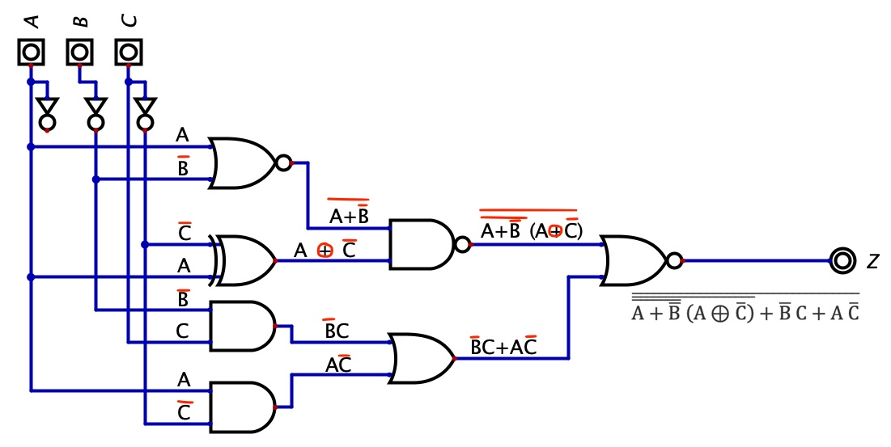
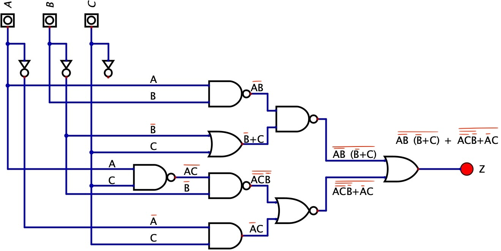

# tca2

Ejercicios de sistemas digitales basados en álgebra Booleana.
Para poder visualizar los fichero se requiere de la aplicacion Digital
Puede descargarse de <https://github.com/hneemann/Digital>
Los ficheros se encuentran en el directorio src

Ejercicio 1:

Ejercicio 2:

